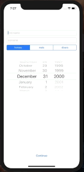
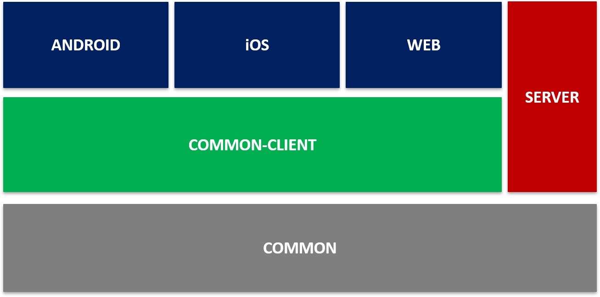

# Kotlin multiplatform sample - swn 

This is an example project to test the possibilities of the Kotlin multiplatform technology. 
It takes a name, birthday and gender and calculate a random monthly insurance cost.
It targets android, iOS and web. 

##### Demo Web  (written with kotlin/JS and kotlin-react)


##### Demo android (written completely in kotlin) 


##### Demo iOS (written in kotlin/native and swift)


## Getting started

If you don't have an android sdk, you can build the application without it, using: `./gradlew build -PskipAndroid`.

### Building the Code

+ make sure you have an Android SDK installed
+ Open the project
+ create and add a file `local.properties` in the root directory of the project:
```sbtshell
sdk.dir=yourLocalPathToAndroidSdk
```
+ look under TODOs and change the url for the server call in `kotlin-multiplatform-sample/commonClient/src/commonMain/kotlin/de.compeople.swn/tarifService/TarifClient`
+ Run `./gradlew build`
+ start the server with: `./gradlew :server:run`

### Build only the server

run : `:server:build -PskipAndroid`

### Running the Android app

+ Create a run configuration of type "Android App"
+ Select module "app" in the run configuration settings
+ run the configuration

### Running the iOS-App

+ start the server with: `./gradlew :server:run`
+ Open the XCode project under `native`
+ Run it as normal

### Running the website

+ build the website with: `./gradlew :web:build`
+ start with: `./gradlew :web:webpack-run`

### Running the tests
First you have to adjust the url for the server call: 
look under TODOs and change the url for the server call in 
`kotlin-multiplatform-sample/commonClient/src/commonTest/kotlin/test.de.compeople.swn/tarifService/TarifClientTest`
                                                      
There a Tests in the common and the commonClient module. To run the Test use: 
+ `kotlin-multiplatform-sample:common:check`
+ `kotlin-multiplatform-sample:commonClient:check`

At the moment the tests for js are disabled, because mockk for JS is not ready yet for coroutines.

## Architecture
A simple block architecture for a quickly overview:
<br />  <br />

## Built With
+ [Gradle](https://gradle.org/) - Dependency Management
+ [Ktor](https://ktor.io/)
+ [kotlin-Wrappers](https://github.com/JetBrains/kotlin-wrappers) - kotlin-react, kotlin-react-com for the web
+ [mockK](https://mockk.io/) - mocking library 

## License
This project is licensed under the MIT License.
